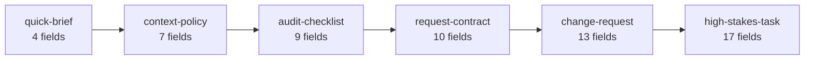

# psychic-templates


A prompt-contract template library: fill-in contracts that make a request's incompleteness
visible, durable, and safe to execute around — instead of optimizing it into something that
merely looks complete. Extracted from the psychic-crew program (born at its HELIX gate SIDE-0),
where every discipline here ran first as law: the intake contract, the single risk vocabulary,
the evidence labels, the UNKNOWN doctrine.

**PUBLIC** since an out-of-band flip after creation (flip date unrecorded — gh pushedAt matches
the birth commit; ratified 2026-08-31, see the VIS-RECONCILE ledger row). Private at creation.

## The doctrine

> A field left blank is UNKNOWN and stays UNKNOWN: the executor never fills it by guess — it may
> ask a bounded question or proceed with the unknown recorded in the output.

Every template embeds that line verbatim; the validator proves it. `SCHEMA.md` defines every
field any template may use — a template naming an undefined field is a validator FAIL, both
directions, mechanically.

## The library — **6 templates**

| Template | Use when |
|---|---|
| `templates/request-contract.md` | The minimal executable core: ten fields, the front door for any serious request. |
| `templates/high-stakes-task.md` | Full rigor: audits, irreversible work, anything where "looks done" is the enemy. |
| `templates/context-policy.md` | The boundary block: what may be read, what may leave, who filters it. |
| `templates/audit-checklist.md` | Binary-execution audits over an existing corpus; report, never silently correct. |
| `templates/quick-brief.md` | The floor: four fields for small load-bearing asks that still must not guess. |
| `templates/change-request.md` | Bounded changes to live systems: thirteen fields, the rung the 10-17 gap demanded. |

## The ladder

Pick by weight. The numbers are BOUND: `validate-templates` recomputes every template's distinct
`## Fields` count live and fails this picture on drift.



## What is not asserted

The suite binds structure, vocabulary, the single risk scale, the doctrine line, and the ladder
counts. It does NOT assert fitness: whether a template matches a request's real weight is
judgment (each Verification section says what "valid" means; climbing or descending the ladder
is yours). Stated here so the green suite is read as what it is.

## Quickstart

```bash
git clone https://github.com/nathan-hayashi/psychic-templates.git
cd psychic-templates && ./scripts/validate-templates.sh
```

Copy a template, fill what you know, list what you don't in `unknown_fields`, and hand the
result to your executor — human or agent. The contract is the interface.

## Why not a prompt optimizer?

`docs/AUDIT-vs-promptbuilder.md` is the head-to-head against promptbuilder.cc, criteria fixed
before scoring. Short version: an optimizer fills gaps by assumption to produce a fluent prompt
in seconds; this library refuses precisely that move. Different failure costs, different tools.

## Lineage and law

`CLAUDE.md` is the law; `GATES.md` the ledger; `scripts/validate-templates.sh` the definition of
working (negative controls included — the checks are proven to fire, not assumed to). The field
vocabulary feeds the TEI Context Envelope (parent repo, `docs/research/TEI-PREPLAN.md`, TEI-0).
